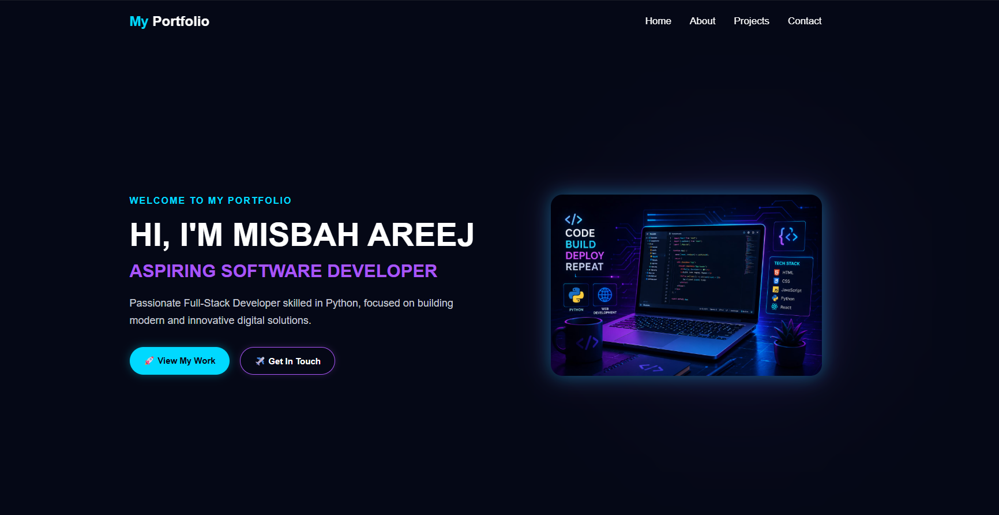
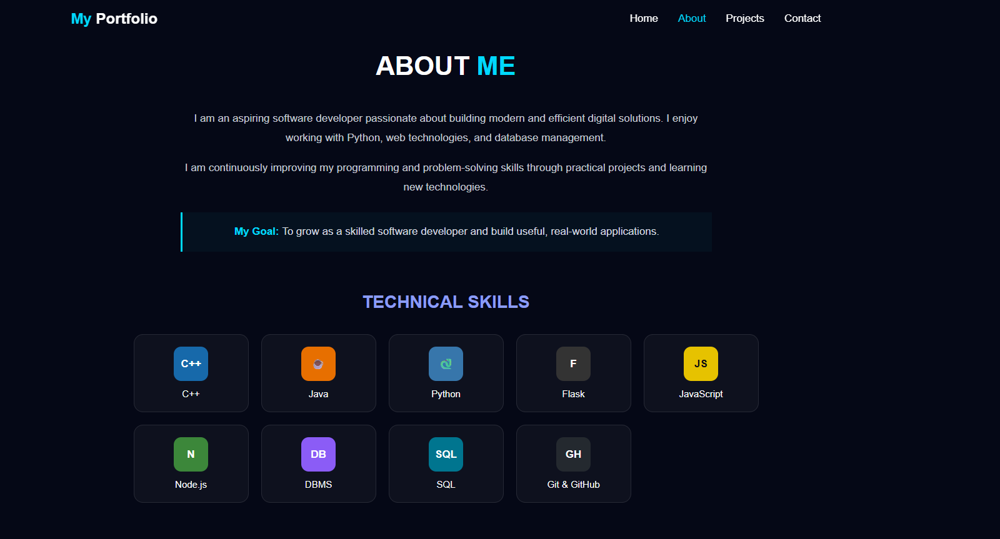
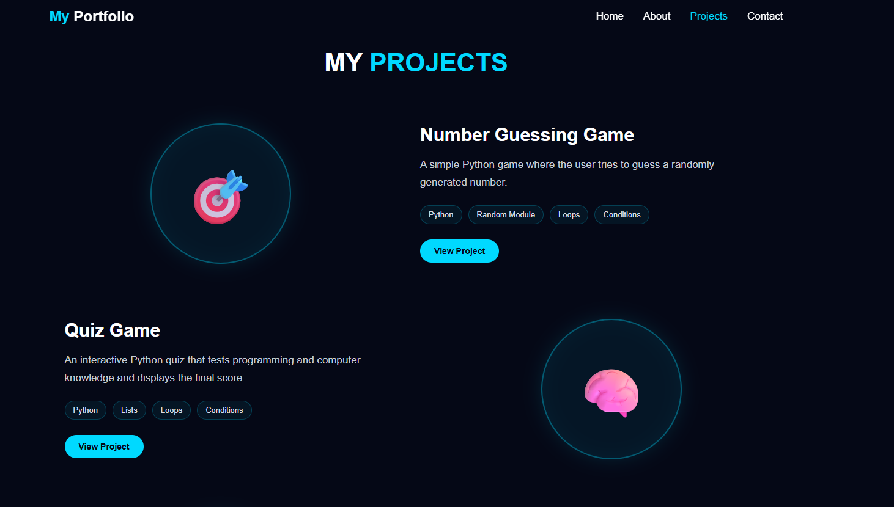
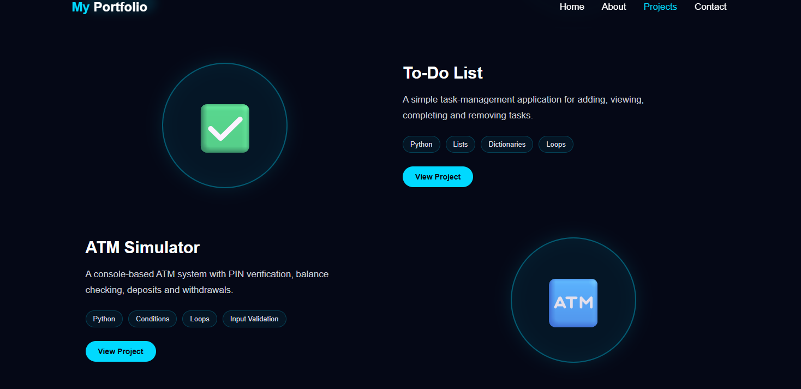
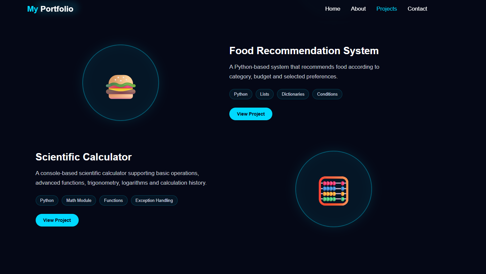
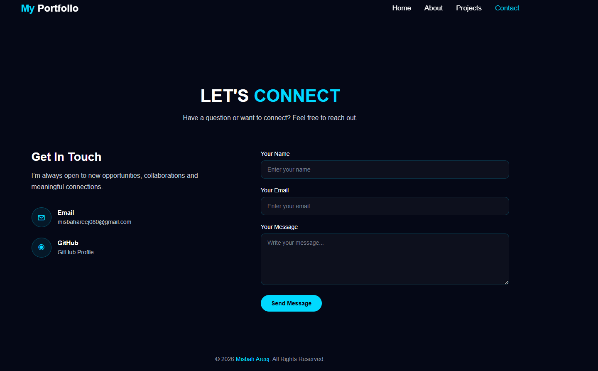

# 🌐 Personal Portfolio Website

A modern and responsive personal portfolio website created to showcase my skills, projects, technical knowledge, and contact information.

The website features a clean dark theme with cyan highlights and a simple professional layout suitable for an internship and developer portfolio.

---

## ✨ Features

- 🏠 Professional Home section
- 👩‍💻 About Me section
- 🛠️ Technical Skills section
- 💻 Projects showcase
- 📩 Contact section
- 📧 Clickable email link
- 🐙 GitHub profile link
- 📝 Contact form
- 📱 Responsive design
- 🔗 Navigation links
- ©️ Footer with copyright information

---

## 🧩 Website Sections

### 🏠 Home

The Home section introduces me as an aspiring software developer and provides quick navigation buttons to view my work and get in touch.

### 👩‍💻 About Me

The About section contains a short introduction, my professional goal, and my technical skills.

### 💻 My Projects

The Projects section showcases six Python projects:

1. Number Guessing Game
2. Quiz Game
3. To-Do List
4. ATM Simulator
5. Food Recommendation System
6. Scientific Calculator

Each project includes a short description, technologies and concepts used, and a View Project button.

### 📩 Let's Connect

The Contact section allows visitors to:

- View my email address
- Visit my GitHub profile
- Enter their name
- Enter their email
- Write a message
- Submit the contact form

---

## 🛠️ Technologies Used

- HTML5
- CSS3
- JavaScript
- Python
- Git & GitHub
- Visual Studio Code

---

## 📸 Screenshots

### 🏠 Home

---

### 👩‍💻 About Me & Technical Skills

---

### 💻 Projects — Number Guessing Game & Quiz Game

---

### 💻 Projects — To-Do List & ATM Simulator

---

### 💻 Projects — Food Recommendation System & Scientific Calculator

---

### 📩 Contact & Footer

---

## 📁 Project Structure

    portfolio/
    │
    ├── index.html
    ├── style.css
    ├── script.js
    │
    ├── images/
    │   └── project images/icons
    │
    ├── screenshots/
    │   ├── home.png
    │   ├── about.png
    │   ├── projects-1.png
    │   ├── projects-2.png
    │   ├── projects-3.png
    │   └── contact.png
    │
    └── README.md

---

## 🚀 How to Run

1. Download or clone the repository.
2. Open the project folder in Visual Studio Code.
3. Make sure index.html, style.css, and script.js are correctly connected.
4. Open index.html in a browser or use the Live Server extension in Visual Studio Code.
5. Explore the Home, About, Projects, and Contact sections.

---

## 🎯 Project Goal

The goal of this project is to create a professional online portfolio that presents my programming skills, academic projects, and learning journey in a simple and user-friendly way.

---

## 📌 Future Improvements

- Connect project buttons to their individual GitHub repositories.
- Add more projects as they are completed.
- Connect the contact form to a real email service.
- Add more interactive JavaScript features.

---

## 👩‍💻 Author

**Misbah Areej**

Aspiring Software Developer | BS Information Technology Student

---

## 📄 License

This project is created for personal portfolio and learning purposes.

---

## ⭐ Support

If you like this project, please consider sharing it with others.
