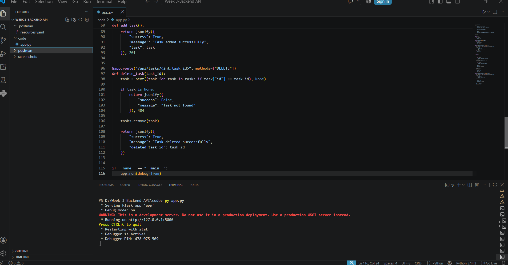
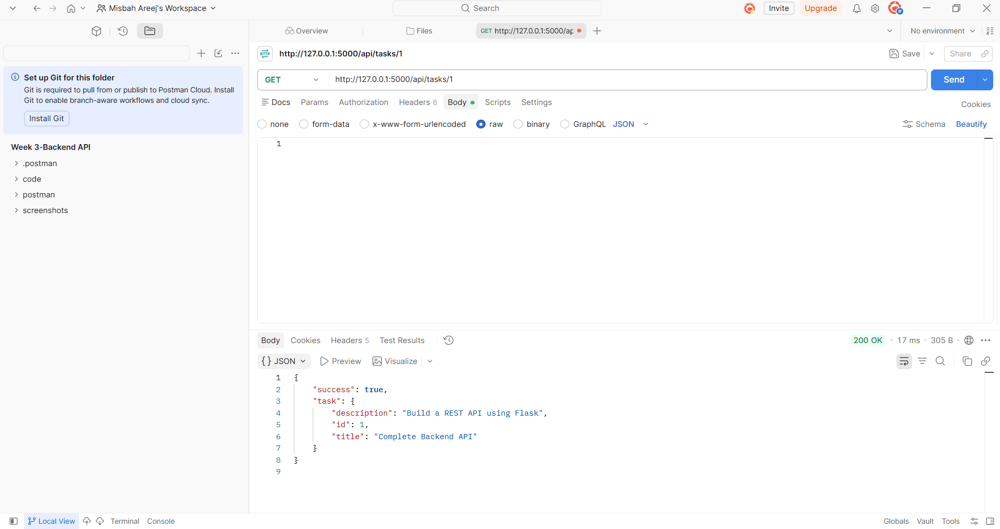
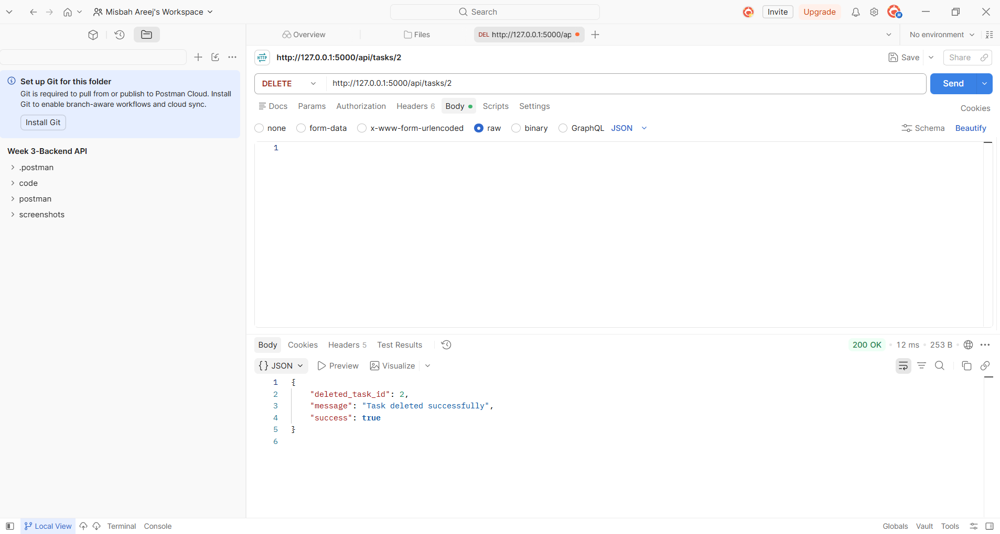
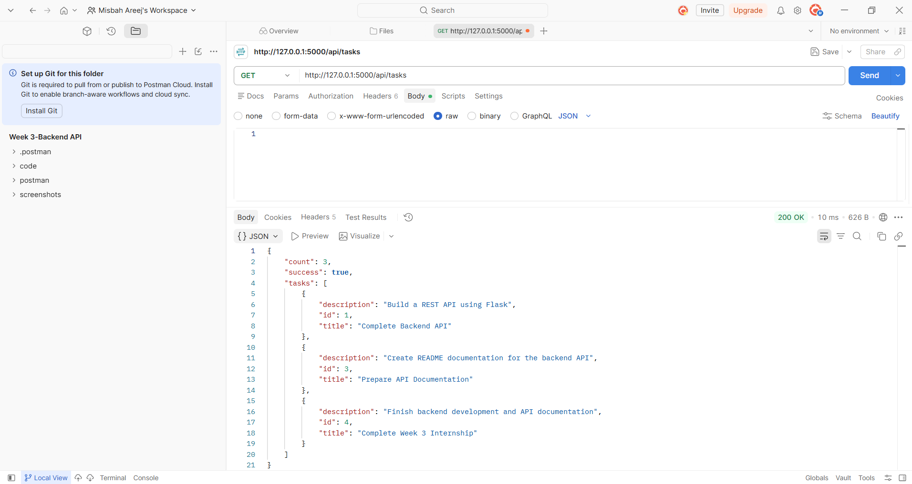

# 🚀 BACKEND DEVELOPMENT PROJECT

# 📋 Task Management REST API

A professional **Task Management REST API** developed using **Python and Flask** as part of **Week 3 – Backend Development Basics** during an internship.

This project demonstrates practical backend development concepts including REST API development, routing, HTTP methods, JSON data handling, error handling, task management, and API testing using Postman.

---

## 🎯 Project Objective

The objective of this project is to develop a simple and functional REST API for managing tasks.

The API provides the following functionality:

- ➕ Add a new task
- 👀 View all tasks
- 🔍 View a single task
- 🗑️ Delete a task
- 📦 Handle JSON request and response data
- ⚠️ Handle basic API errors
- 🧪 Test API endpoints using Postman

---

## 🛠️ Technologies Used

| Technology | Purpose |
|---|---|
| 🐍 Python | Backend programming language |
| 🌐 Flask | Web framework used to develop the REST API |
| 🔌 REST API | Backend API architecture |
| 📦 JSON | Data format for API requests and responses |
| 🧪 Postman | API testing and verification |
| 💻 Visual Studio Code | Development environment |

---

# 📂 Project Structure

    week3-backend-api/
    │
    ├── app.py
    ├── README.md
    │
    └── screenshots/
        ├── 01_Server_Running.png
        ├── 02_GET_All_Tasks.png
        ├── 03_GET_Single_Task.png
        ├── 04_POST_Add_Task.png
        ├── 05_DELETE_Task.png
        └── 06_GET_After_Delete.png

---

# ⚙️ How to Run the Project

## 1️⃣ Install Flask

Open the Visual Studio Code terminal and run:

    pip install flask

## 2️⃣ Run the Application

    python app.py

## 3️⃣ Start the Backend Server

If the application starts successfully, Flask will run the server at:

    http://127.0.0.1:5000

## 4️⃣ Check the Backend in Browser

Open:

    http://127.0.0.1:5000

### 📥 Response

    {
        "message": "Task Management REST API is running",
        "version": "1.0"
    }

---

# 🔌 API Documentation

## 🌐 Base URL

    http://127.0.0.1:5000

## 📋 Available API Endpoints

| Method | Endpoint | Description |
|---|---|---|
| 🟢 GET | `/api/tasks` | Retrieve all tasks |
| 🔍 GET | `/api/tasks/<task_id>` | Retrieve a specific task |
| ➕ POST | `/api/tasks` | Add a new task |
| 🗑️ DELETE | `/api/tasks/<task_id>` | Delete a specific task |

---

# 🟢 1. GET — All Tasks

## Endpoint

    GET /api/tasks

## Full URL

    http://127.0.0.1:5000/api/tasks

## 📌 Description

This endpoint retrieves all tasks currently stored in the application.

## 📤 Request

**Method:** GET

**Request Body:** Not required.

## 📥 Successful Response

**HTTP Status Code:** 200 OK

    {
        "success": true,
        "count": 3,
        "tasks": [
            {
                "id": 1,
                "title": "Complete Backend API",
                "description": "Build a REST API using Flask"
            },
            {
                "id": 2,
                "title": "Test API with Postman",
                "description": "Test GET, POST and DELETE endpoints"
            },
            {
                "id": 3,
                "title": "Prepare API Documentation",
                "description": "Create README documentation for the backend API"
            }
        ]
    }

---

# 🔍 2. GET — Single Task

## Endpoint

    GET /api/tasks/<task_id>

## Example URL

    http://127.0.0.1:5000/api/tasks/1

## 📌 Description

This endpoint retrieves a specific task using its unique task ID.

## 📤 Request

**Method:** GET

**Request Body:** Not required.

**Path Parameter:** task_id

Example:

    /api/tasks/1

## 📥 Successful Response

**HTTP Status Code:** 200 OK

    {
        "success": true,
        "task": {
            "id": 1,
            "title": "Complete Backend API",
            "description": "Build a REST API using Flask"
        }
    }

## ⚠️ Error Response

If the requested task ID does not exist:

**HTTP Status Code:** 404 Not Found

    {
        "success": false,
        "message": "Task not found"
    }

---

# ➕ 3. POST — Add New Task

## Endpoint

    POST /api/tasks

## Full URL

    http://127.0.0.1:5000/api/tasks

## 📌 Description

This endpoint creates and adds a new task to the task list.

## 📤 Request

**Method:** POST

**Content-Type:** application/json

## 📦 Request Body

The request body should be provided in JSON format:

    {
        "title": "Complete Week 3 Internship",
        "description": "Finish backend development and API documentation"
    }

## 📝 Request Fields

| Field | Type | Required | Description |
|---|---|---|---|
| `title` | String | Yes | Title of the task |
| `description` | String | No | Description of the task |

## 📥 Successful Response

**HTTP Status Code:** 201 Created

    {
        "success": true,
        "message": "Task added successfully",
        "task": {
            "id": 4,
            "title": "Complete Week 3 Internship",
            "description": "Finish backend development and API documentation"
        }
    }

## ⚠️ Error Response — Missing Request Body

If no request body is provided:

**HTTP Status Code:** 400 Bad Request

    {
        "success": false,
        "message": "Request body is required"
    }

## ⚠️ Error Response — Missing Title

If the task title is not provided:

**HTTP Status Code:** 400 Bad Request

    {
        "success": false,
        "message": "Task title is required"
    }

---

# 🗑️ 4. DELETE — Delete Task

## Endpoint

    DELETE /api/tasks/<task_id>

## Example URL

    http://127.0.0.1:5000/api/tasks/2

## 📌 Description

This endpoint deletes a specific task using its unique task ID.

## 📤 Request

**Method:** DELETE

**Request Body:** Not required.

**Path Parameter:** task_id

Example:

    /api/tasks/2

## 📥 Successful Response

**HTTP Status Code:** 200 OK

    {
        "success": true,
        "message": "Task deleted successfully",
        "deleted_task_id": 2
    }

## ⚠️ Error Response

If the requested task ID does not exist:

**HTTP Status Code:** 404 Not Found

    {
        "success": false,
        "message": "Task not found"
    }

---

# 📦 Initial Tasks

The application starts with three predefined tasks.

### 📝 Task 1

**ID:** 1

**Title:** Complete Backend API

**Description:** Build a REST API using Flask

### 🧪 Task 2

**ID:** 2

**Title:** Test API with Postman

**Description:** Test GET, POST and DELETE endpoints

### 📚 Task 3

**ID:** 3

**Title:** Prepare API Documentation

**Description:** Create README documentation for the backend API

---

# 🧪 Postman Testing

Postman was used to test and verify the REST API endpoints.

| Test | Method | Endpoint | Request Body | Expected Status |
|---|---|---|---|---|
| View all tasks | GET | `/api/tasks` | Not Required | 200 OK |
| View single task | GET | `/api/tasks/1` | Not Required | 200 OK |
| Add new task | POST | `/api/tasks` | JSON Required | 201 Created |
| Delete task | DELETE | `/api/tasks/2` | Not Required | 200 OK |
| Verify deletion | GET | `/api/tasks` | Not Required | 200 OK |

---

# 📸 Project Screenshots

All project screenshots are stored inside the `screenshots` folder.

## 1️⃣ 🚀 Server Running

The Flask backend server was successfully started using Visual Studio Code.

**Command Used:**

    python app.py

**Server URL:**

    http://127.0.0.1:5000

---

## 2️⃣ 🟢 GET — All Tasks

This screenshot shows the successful GET request used to retrieve all available tasks.

**Endpoint:**

    GET /api/tasks

---

## 3️⃣ 🔍 GET — Single Task

This screenshot shows the successful GET request used to retrieve a specific task by ID.

**Endpoint:**

    GET /api/tasks/1

---

## 4️⃣ ➕ POST — Add Task

This screenshot shows the successful POST request used to add a new task.

**Endpoint:**

    POST /api/tasks

**Request Body:**

    {
        "title": "Complete Week 3 Internship",
        "description": "Finish backend development and API documentation"
    }

---

## 5️⃣ 🗑️ DELETE — Delete Task

This screenshot shows the successful DELETE request used to remove a task.

**Endpoint:**

    DELETE /api/tasks/2

---

## 6️⃣ ✅ GET — After Delete

This screenshot verifies that the selected task was successfully deleted and the remaining tasks are still available.

**Endpoint:**

    GET /api/tasks

---

# ⚠️ Error Handling

The API includes basic error handling for invalid requests.

## ❌ 400 — Bad Request

### Missing Request Body

    {
        "success": false,
        "message": "Request body is required"
    }

### Missing Task Title

    {
        "success": false,
        "message": "Task title is required"
    }

---

## ❌ 404 — Not Found

### Task Not Found

If the requested task ID does not exist:

    {
        "success": false,
        "message": "Task not found"
    }

This error can occur with:

    GET /api/tasks/<task_id>

or:

    DELETE /api/tasks/<task_id>

---

# 📚 REST API Concepts Demonstrated

- 🌐 REST API architecture
- 🛣️ API routing
- 🟢 HTTP GET method
- ➕ HTTP POST method
- 🗑️ HTTP DELETE method
- 🔢 URL path parameters
- 📦 JSON request and response handling
- 📊 HTTP status codes
- ⚠️ Error handling
- 🧪 API testing with Postman

---

# 🎓 Internship Learning Outcomes

Through this project, I gained practical experience in:

- Developing a backend application using Flask
- Creating REST API endpoints
- Working with HTTP methods
- Handling JSON request and response data
- Creating and managing API routes
- Testing APIs using Postman
- Understanding request and response cycles
- Implementing basic API error handling
- Documenting API endpoints professionally

---

# 🚀 Future Improvements

The project can be extended with:

- 🗄️ Database integration using SQLite or MySQL
- ✏️ Update task functionality using PUT/PATCH
- ☑️ Task completion status
- 🔐 User authentication
- 👤 User registration and login
- 🔎 Task search and filtering
- ☁️ Cloud deployment
- 🔒 Improved validation and security

---

# 👩‍💻 Project Information

| Detail | Information |
|---|---|
| 📌 Project | Task Management REST API |
| 📅 Week | Week 3 – Backend Development Basics |
| 🐍 Language | Python |
| 🌐 Framework | Flask |
| 🔌 API Type | REST API |
| 🧪 Testing Tool | Postman |
| 💻 IDE | Visual Studio Code |
| 📊 Project Status | ✅ Completed |

---

# ⭐ Support

If you found this project useful or interesting, please consider giving this repository a **⭐ Star** on GitHub.

Your support is appreciated! ❤️

---

# 🏆 Project Status

**Completed — Backend API developed, tested with Postman, documented, and prepared for GitHub submission.**
